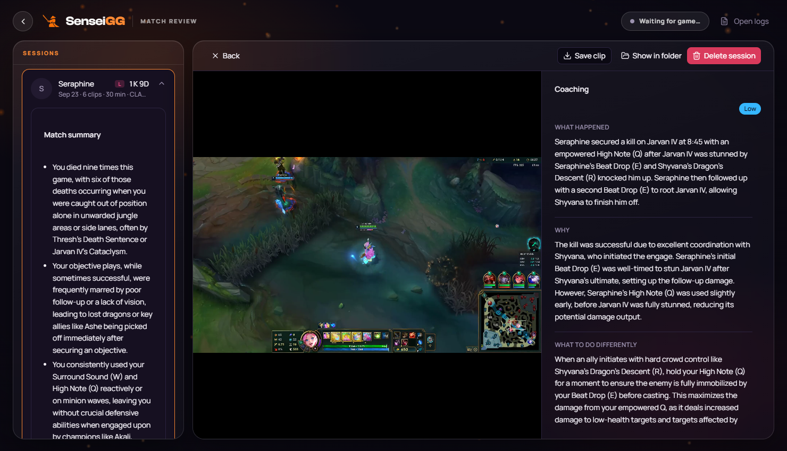
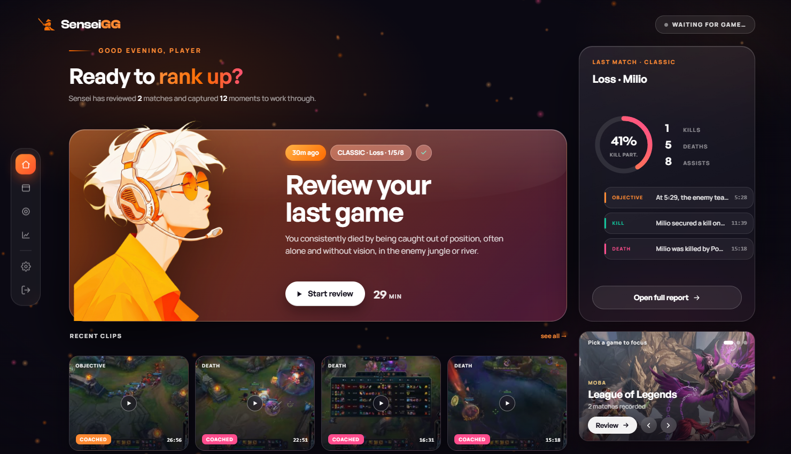
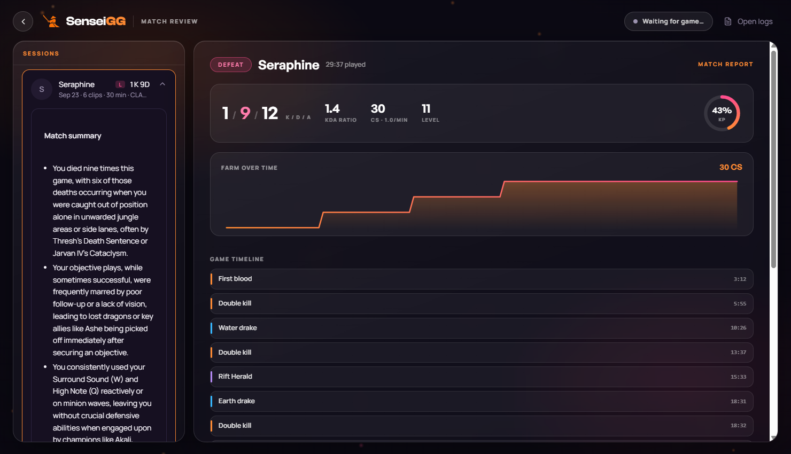
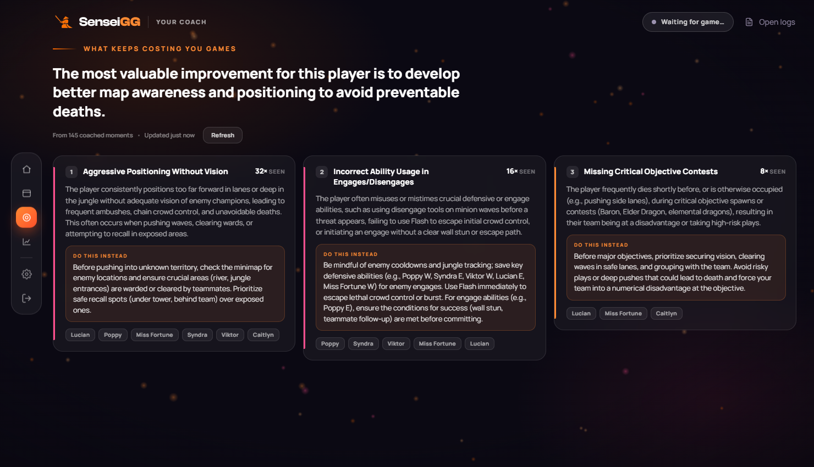
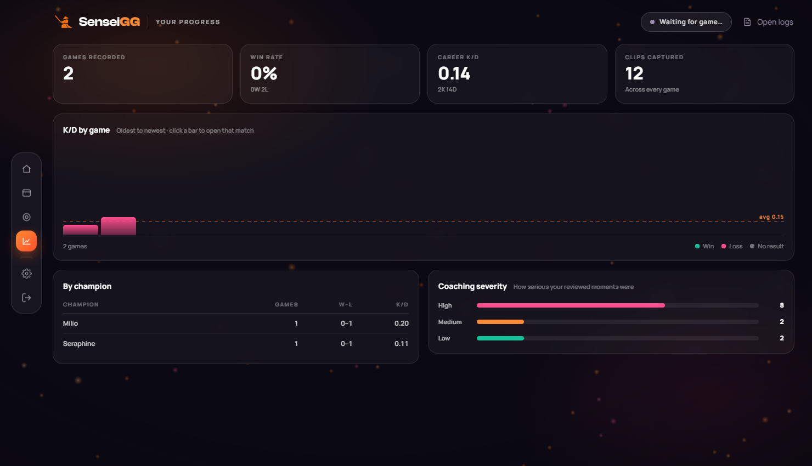
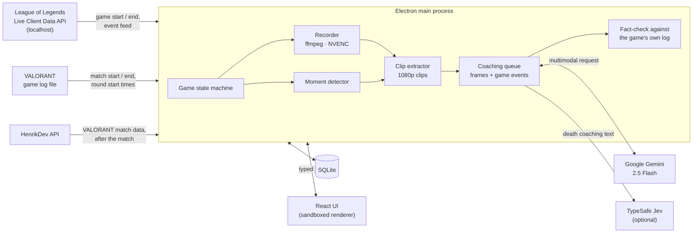

# sensei.gg

**Your AI gaming coach, for Windows.**
It records your games, clips your key moments, and explains each one with AI coaching, with no manual effort.
Supports League of Legends and VALORANT today.

**[⬇ Download for Windows](https://github.com/ofriv/sensei.gg-releases/releases/latest/download/sensei-gg-setup.exe)** · [Website](https://sensei-gg.vercel.app) · [Release notes](https://github.com/ofriv/sensei.gg-releases/releases)

---

## What this repository is

This repository is where the **Windows installer** is published. Each version is
a [release](https://github.com/ofriv/sensei.gg-releases/releases) with the
installer attached. The application's source code lives in a separate, private
repository. If you are reviewing this project and need access to the code,
please contact the author.

## What the app does

You play League of Legends or VALORANT as usual. sensei.gg runs in the system
tray and:

1. **Notices when a match starts** and records it in the background.
2. **Finds your kills, deaths and objectives.** For League, from the game's live
   event feed (dragons, Baron, Rift Herald). For VALORANT, which has no live
   feed, from the match data after the game (including your spike plants and
   defuses).
3. **Cuts a short clip of each moment** when the match ends.
4. **Coaches every clip.** It sends frames from the clip, plus what the game
   logged at that moment, to Google's Gemini model. What comes back names the
   actual champions and abilities involved. It says *what happened*, *why*, and
   *what to do differently*.
5. **Summarises each game** and, across games, names the mistakes you keep
   repeating, kept separate per game.
6. **Counts why you die** (optional). TypeSafe's Jev sorts every coached death
   into one fixed cause (caught out, overextended, dry peek, no trade...), so
   Stats can show your habits as numbers.

When the game ends, you open the app and your clips and coaching are waiting.

## Try it in two minutes, no game required

The installer includes a **demo**: three real recorded matches (two League,
one VALORANT) with sixteen clips, each already coached. It works without a game
installed, an internet connection or an API key.

1. [Download the installer](https://github.com/ofriv/sensei.gg-releases/releases/latest/download/sensei-gg-setup.exe) and run it.
   The installer is not code-signed, so Windows SmartScreen will warn you. Choose
   **More info → Run anyway**.
2. On the first screen, click **Explore the demo**.
3. Click any clip in the left column to watch it with its coaching.
   **Matches**, **Coach** and **Stats** in the left rail show the rest.

## Using it for real

- **Windows 10 or 11**, and **League of Legends** or **VALORANT**.
- A **Google Gemini API key**, free from [Google AI Studio](https://aistudio.google.com/app/apikey).
  Paste it in **Settings → API key**. Recording and clipping work without a key;
  coaching needs one.
  **Note:** AI Studio now also issues keys beginning `AQ.`, which the Gemini SDK
  the app uses does not accept yet. A key beginning `AIza…` works.
- For VALORANT, also a **HenrikDev API key**, free from the
  [HenrikDev dashboard](https://api.henrikdev.xyz/dashboard/). VALORANT has no
  live API, so the app fetches each match from HenrikDev once it ends. Keep the
  game on your main monitor; window capture needs an NVIDIA driver 610 or newer
  (older drivers fall back to recording the screen).
- For **Why you die**, optionally a **TypeSafe API key**. Without one, nothing
  else changes.
- Keys entered in Settings are encrypted on your PC.
- Leave the app running (it sits in the tray) and play. Clips and coaching
  appear a minute or two after each game ends.

The app keeps your **last 20 games**. Clips are 1080p and each game's clips take
roughly 100 MB. The newest game's full recording is kept (about 4 GB) so its
clips can be re-cut; older recordings are deleted.

## Screenshots

| | |
|---|---|
|  |  |
| **Home.** Your last game, its coached moments and your recent clips. | **Match report.** Stats, farm over time and the game's timeline, with the AI's summary of the match. |
|  |  |
| **Coach.** The patterns that repeat across all your coached moments, and what to do instead. | **Stats.** Your record, K/D per game against your own average, and how serious your mistakes were. |

## How it works

Everything runs on your PC. There is no server and no account. Clip frames go
to Gemini for coaching; a VALORANT match id goes to HenrikDev; and, if you turn
it on, each death's coaching text goes to TypeSafe. (The interface also
downloads champion and agent portraits, and its fonts from Google Fonts and
Fontshare.)

**Technical notes:**

- **League detection.** Riot's [Live Client Data API](https://developer.riotgames.com/docs/lol#game-client-api)
  is polled every 5 s while idle and every second in game. A state machine
  decides when a game has really started and ended: it takes three failed polls
  in a row to end one, so a single dropped request can't cut a game short.
- **VALORANT detection.** Riot allows no live API for VALORANT, so the app
  reads the game's own log file, which records when a match starts and ends and
  the exact start of every round. Reading a file touches nothing in the game
  process, so Vanguard is unaffected.
- **Recording.** ffmpeg records with the graphics card's hardware encoder
  (NVENC), falling back to the CPU when there is none. League records the
  screen at native resolution; VALORANT records only the game's window. It
  writes MKV first, so a crash mid-game still leaves a playable file.
- **Putting clips on the right moment.** Riot's event times are game-clock
  times. The game clock holds at 0:00 while players load, from a few seconds to
  well over a minute, so the first reading can't be trusted. The app measures
  where the clock really was when the video started and stores that per game.
  Every clip is cut from that anchor.
- **Clips.** Kills get 15 seconds, deaths 20 and objectives 23. Kills within 10
  seconds merge into one clip labelled Double to Penta Kill, following League's
  own multikill rules. In VALORANT, a round's kills merge into one clip
  labelled 2K to Ace, and each kill is placed at its round's logged start plus
  its time into the round.
- **Coaching.** Each clip is sampled to 7–18 frames. They go to Gemini 2.5
  Flash together with the game's roster and every event inside the clip (for
  VALORANT, also the round, score, side and economy).
  Before an answer is saved, it is **fact-checked against the game's log**.
  It is rejected if it names a champion or agent who wasn't in the game, has teammates
  killing each other, or describes a death the log doesn't show. A rejected
  answer gets one correction round; if that also fails, the clip is marked
  failed rather than showing wrong coaching.
- **Reliability.** Coaching jobs are queued in SQLite, so quitting mid-way
  resumes on the next launch. Every stage of the pipeline has a visible status
  in the UI, and nothing fails silently.
- **Security.** The UI runs sandboxed, with context isolation and no Node.js
  access. It reaches the engine only through typed IPC channels, and every ID
  crossing that boundary is validated. API keys never leave the main
  process, and are encrypted at rest with Windows' own data protection.

## Built with

| | |
|---|---|
| App | Electron 39, TypeScript 5.9, React 19 |
| UI | Tailwind CSS 4, Radix UI, GSAP + Three.js for motion |
| State | Zustand, TanStack Query |
| Video | ffmpeg (hardware encoding with NVENC, libx264 fallback) |
| Game data | Riot Live Client Data API; VALORANT's game log + HenrikDev API |
| AI | Google Gemini 2.5 Flash, multimodal; TypeSafe Jev for death-cause tags |
| Storage | SQLite (better-sqlite3) |
| Quality | Vitest (413 unit tests), ESLint, TypeScript strict mode, GitHub Actions CI |
| Packaging | electron-vite, electron-builder (NSIS installer) |

## Privacy

- Recording runs only while a match is in progress, with no audio at all.
  VALORANT recording captures only the game's window.
- Clips, coaching and stats stay on your PC, in `%APPDATA%\sensei.gg`.
- To coach a clip, the app sends Google a set of still frames from it, plus
  the game's event data. For VALORANT, HenrikDev receives the match id. With
  Why you die on, TypeSafe receives each death's coaching text, with no video
  and no Riot IDs. No other game or personal data leaves your machine.

## Known limitations

- Windows only.
- VALORANT match data comes from HenrikDev, a third-party API with rate limits.
- The installer is not code-signed, hence the SmartScreen warning.
- Coaching quality depends on the model. It is checked against the game's
  facts, but the tactical advice is the model's own judgement.

---

sensei.gg isn't endorsed by Riot Games and doesn't reflect the views or
opinions of Riot Games or anyone officially involved in producing or managing
Riot Games properties. Riot Games and all associated properties are trademarks
or registered trademarks of Riot Games, Inc.
